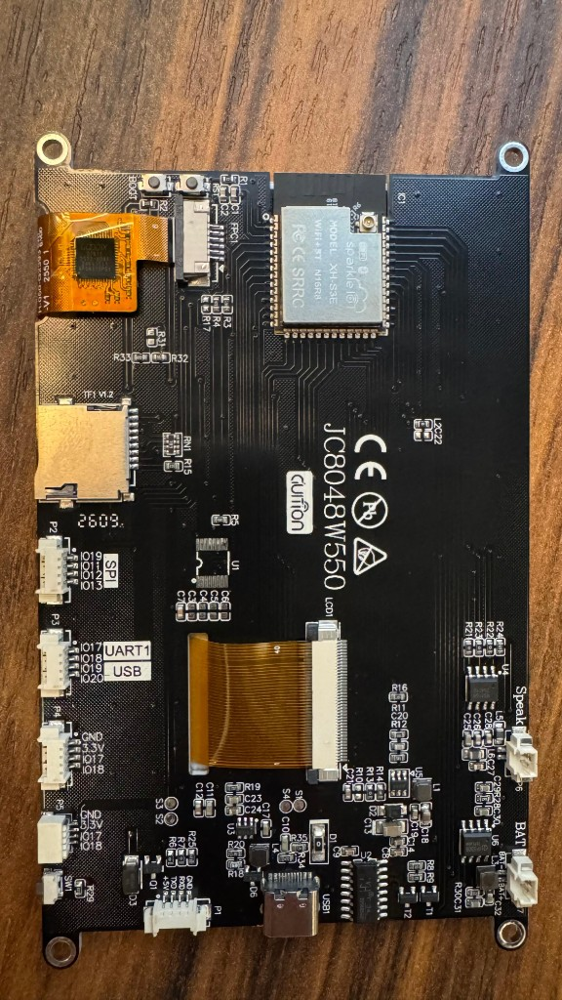

# HA Touch Panel

ESPHome + LVGL firmware for **Guition JC8048W550** (ESP32-S3 N16R8, 800×480 capacitive touch) as Home Assistant room control panels.

First-class HA integration (native API). Entity IDs are set per panel in YAML and compiled into that panel’s firmware.

| | |
|---|---|
| Board | Guition JC8048W550 |
| MCU | ESP32-S3, 16MB flash, 8MB PSRAM |
| Display | 800×480 RGB (`mipi_rgb`) + GT911 touch |
| First panel | `sites/home/panels/suite` |



## Project layout

```text
hardware/guition-jc8048w550.yaml   # shared board definition
packages/common/                     # API, Wi-Fi/Improv, fonts
packages/ui/room-shell.yaml          # shared LVGL UI shell
sites/<site>/panels/<panel>/
  panel.yaml                         # entity IDs + live-state wiring
  factory.yaml                       # release / web-flash entrypoint
  dev.yaml                           # local Wi-Fi via secrets
static/                              # GitHub Pages flash site
.github/workflows/                   # CI, Release, Pages
```

- **Site** (`home`, …) = one house / HA instance  
- **Panel** (`suite`, …) = one physical display  
- Device id for releases = `<site>/<panel>` (e.g. `home/suite`)

## Suite controls

| UI | Entity | Live state |
|----|--------|------------|
| L1–L4 toggles | `light.suite_switch_suite_l1` … `_l4` | on/off |
| RGB | `light.rgb_suite` | on/off, brightness, color presets |
| Cabeceira dimmer | `light.led_cabeceira_suite` | on/off, brightness |
| Persiana | `cover.persiana_suite` | position / movement |
| Climate | `climate.suite_2` | temp, setpoint, HVAC mode, fan |
| Master Off | *(local action)* | turns off L1–L4, RGB, cabeceira |

Edit entity IDs in [`sites/home/panels/suite/panel.yaml`](sites/home/panels/suite/panel.yaml) substitutions, then rebuild/OTA that panel.

## Flash (end users)

1. Open the [GitHub Pages installer](https://dflourusso.github.io/ha-touch-panel/) (after the first release + Pages publish).
2. USB-C → **Install Suite panel** (Chrome/Edge).
3. Configure Wi-Fi via Improv (or SoftAP password `touchpanel-setup`).
4. Adopt in Home Assistant → enable **Allow the device to perform Home Assistant actions**.

You can also download `*.factory.bin` from [Releases](https://github.com/dflourusso/ha-touch-panel/releases).

## Local development

```bash
cp secrets.template.yaml sites/home/panels/suite/secrets.yaml
# edit SSID / password

# Docker (recommended)
docker run --rm -v "$PWD":/config -w /config ghcr.io/esphome/esphome:stable \
  run sites/home/panels/suite/dev.yaml
```

Factory (no home Wi-Fi secrets; SoftAP + Improv):

```bash
docker run --rm -v "$PWD":/config -w /config ghcr.io/esphome/esphome:stable \
  compile sites/home/panels/suite/factory.yaml
```

## Add another panel

1. Copy `sites/home/panels/suite` → `sites/home/panels/<name>`.
2. Change `device_name`, `friendly_name`, `panel_title`, and entity substitutions in `panel.yaml`.
3. Update `factory.yaml` OTA `source` URL to `…/firmware/home-<name>.manifest.json`.
4. Add `home/<name>` to the `device` choice list in [`.github/workflows/release.yml`](.github/workflows/release.yml).
5. Release that device (or `all`).

## Release runbook

1. GitHub → **Actions** → **Release Firmware**
2. Inputs:
   - `version` — semver tag, e.g. `1.0.0`
   - `build_number` — integer build counter (becomes `1.0.0+42` in the build metadata)
   - `device` — `home/suite` or `all`
   - optional `release_notes`
3. Workflow builds factory firmware, uploads a GitHub Release, then **Publish Pages** refreshes the web installer from the latest release assets.

## CI

PRs/pushes that touch YAML compile every discovered `sites/**/factory.yaml` and `dev.yaml` (dev uses `secrets.template.yaml`).

## Notes

- GPIO19/20 are used for the GT911 I²C bus on this board (ESPHome may warn about USB-Serial-JTAG).
- Changing entity bindings requires a recompile/OTA of that panel (not runtime rebinding).
